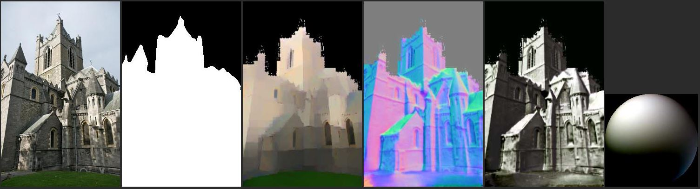

# InverseRenderNet: Learning single image inverse rendering

An implementation of the paper "_InverseRenderNet: Learning single image inverse rendering_", implemented in tensorflow.

Sample image: (more visual samples [here](sample_demos.md))


_**input** an image & mask, **outputs** normal, lighting, albedo & shading_

## Credits

If you use our code, please cite the following paper:

    @inproceedings{yu19inverserendernet,
        title={InverseRenderNet: Learning single image inverse rendering},
        author={Yu, Ye and Smith, William AP},
        booktitle={Proceedings of the IEEE/CVF Conference on Computer Vision and Pattern Recognition (CVPR)},
        year={2019}
    }

for more info see https://ieeexplore.ieee.org/document/8953662

## Evaluation

#### Dependencies
To run our evaluation code, install python packages from requirements.
This code requires python 3.6, newer version of python can cause issues with installing matching tensorflow version.

#### Pretrained model
* Download our pretrained model from: [Link](https://drive.google.com/uc?export=download&id=1VKeByvprmWWXSig-7-fxfXs3KA-HG_-P)
* Unzip the downloaded file 
* Make sure the model files are placed in a folder named "irn_model"


#### Test on demo image
You can perform inverse rendering on random RGB image by our pretrained model. To run the demo code, you need to specify the path to pretrained model, path to RGB image and corresponding mask which masked out sky in the image. The mask can be generated by PSPNet, which you can find on https://github.com/hszhao/PSPNet. Finally inverse rendering results will be saved to the output folder named by your argument.

```bash
python3 test_demo.py --model /PATH/TO/irn_model --image demo.jpg --mask demo_mask.jpg --output test_results
```


#### Test on IIW
* IIW dataset should be downloaded firstly from http://opensurfaces.cs.cornell.edu/publications/intrinsic/#download 
direct link to dataset: http://labelmaterial.s3.amazonaws.com/release/iiw-dataset-release-0.zip
* Run testing code where you need to specify the path to model and IIW data:
```bash
python3 test_iiw.py --model /PATH/TO/irn_model --iiw /PATH/TO/iiw-dataset
```

## Training

#### Train from scratch
The training for InverseRenderNet contains two stages: pre-train and self-train.
* To begin with pre-train stage, you need to use training command specifying option `-m` to `pre-train`. 
* After finishing pre-train stage, you can run self-train by specifying option `-m` to `self-train`. 

In addition, you can control the size of batch in training, and the path to training data should be specified.

An example for training command:
```bash
python3 train.py -n 2 -p Data -m pre-train
```

#### Data for training
To directly use our code for training, you need to pre-process the training data to match the data format as shown in examples in `Data` folder. 

In particular, we pre-process the data before training, such that five images with great overlaps are bundled up into one mini-batch, and images are resized and cropped to a shape of 200 * 200 pixels. Along with input images associated depth maps, camera parameters, sky masks and normal maps are stored in the same mini-batch. For efficiency, every mini-batch containing all training elements for 5 involved images are saved as a pickle file. While training the data feeding thread directly load each mini-batch from corresponding pickle file.


