demo results:

original demo only had 1 exterior building
so tested the pretrained model on a texture and interior

input images:

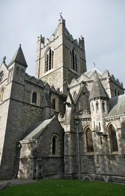
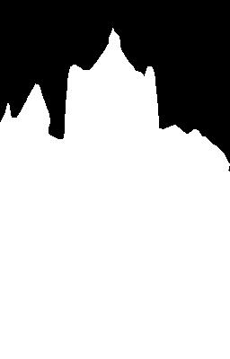

output images:

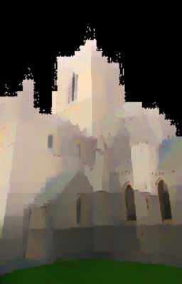
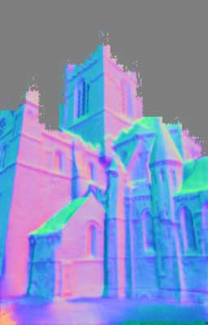
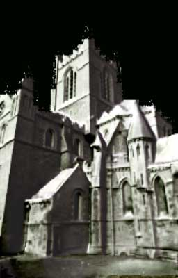
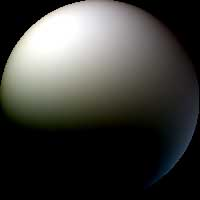

input images:

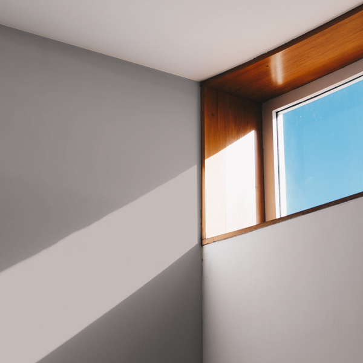
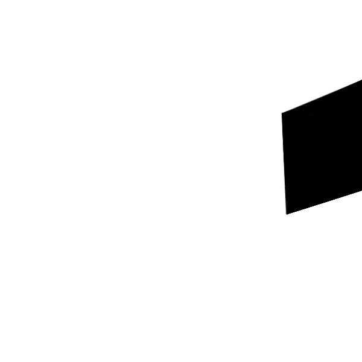

output images:

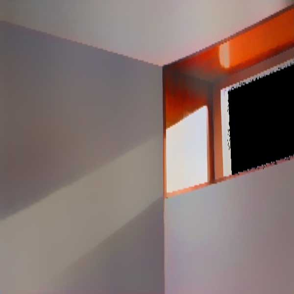
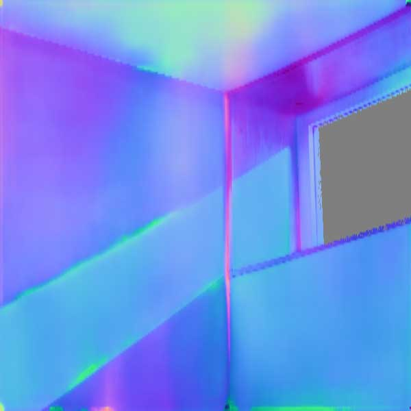
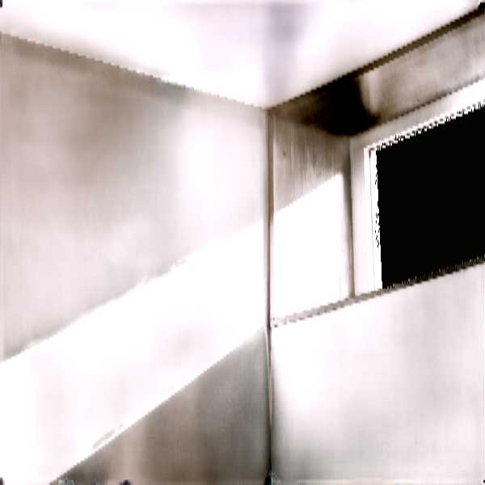
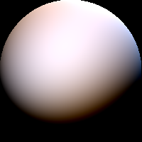

input images:

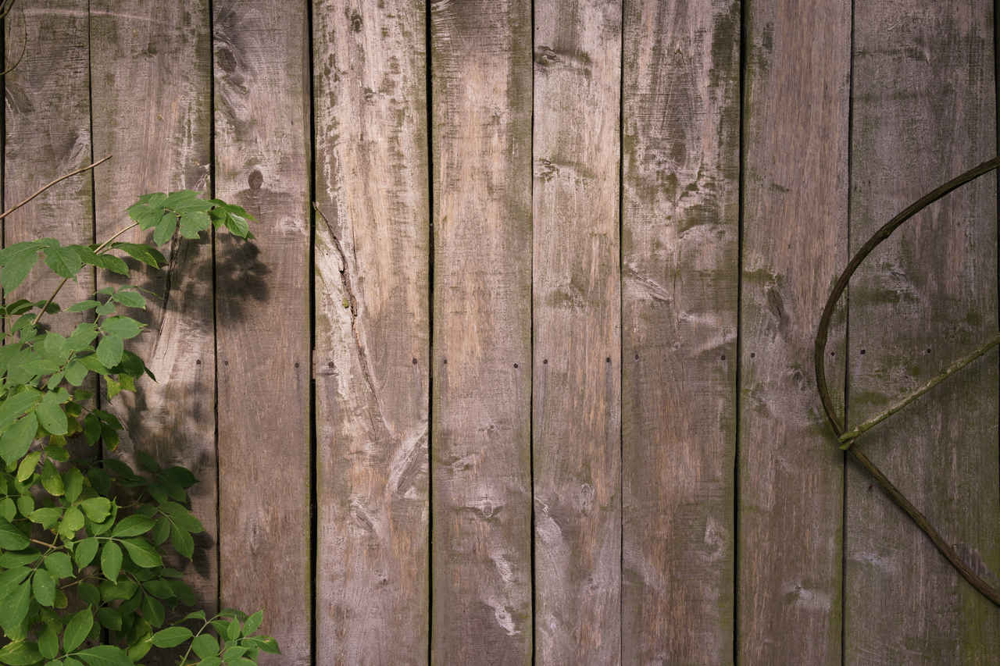

output images:

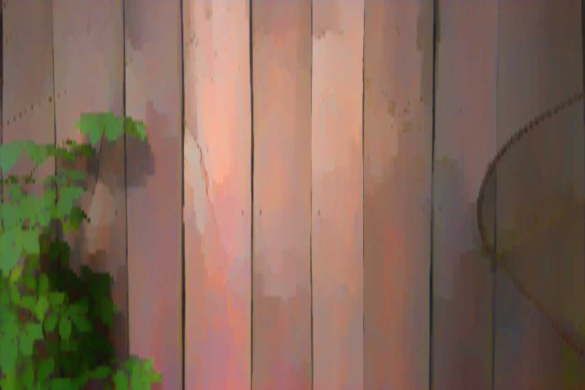
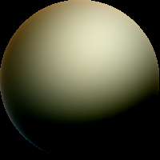
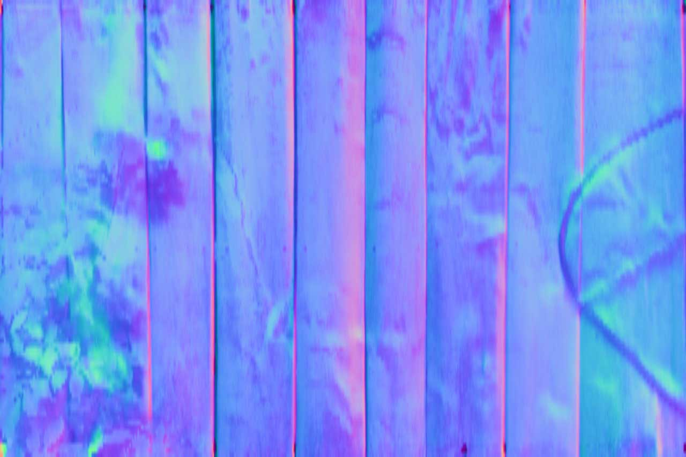
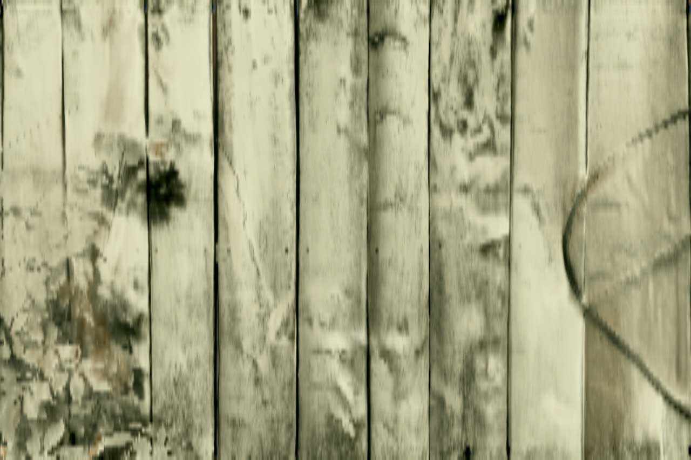

demo output is saved as jpg to reduce filesize of repo. actual output is PNG and includes a PNG copy of the input image.
input can be jpg.

results are quite organic and would need some work to use in games, but can form a good base for texture creation.

results with the pretrained model are better at a low inputsize (default 200) but sharper at a higher input size (same resolution as input texture)
